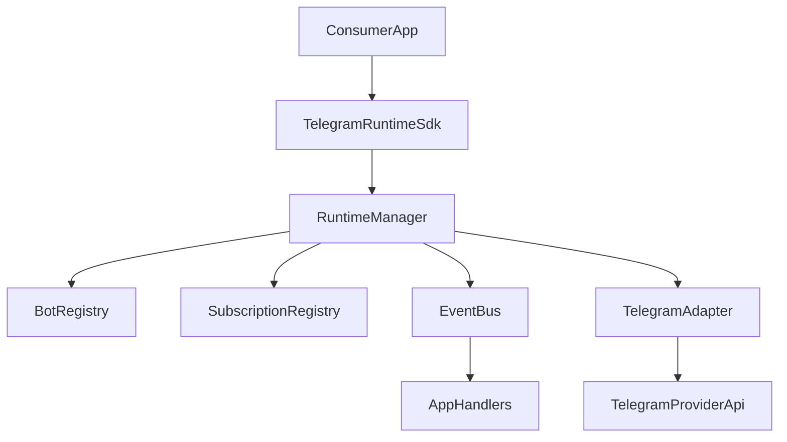

# PRD - Telegram Adapter Kit (Greenfield, TypeScript)

## 1) Vision del Producto

Construir desde cero un paquete reusable de Telegram para Node.js/TypeScript que permita:

- Registrar instancias runtime de Telegram en tiempo de ejecucion, manteniendo la API publica basada en `botId` pero soportando internamente clientes MTProto y bots Bot API.
- Leer mensajes entrantes de chats/canales configurados dinamicamente.
- Escribir mensajes en canales normales y en topics (temas).
- Integrarse en cualquier dominio de negocio sin acoplamiento.

Este PRD asume una construccion greenfield: no depende de estructura previa ni de artefactos heredados.

**Repositorio:** `telegram-adapter-kit`. En npm suele publicarse como `@tu-organizacion/telegram-adapter-kit` (scope opcional).

## 2) Problema a Resolver

Hoy, integrar Telegram en proyectos backend suele requerir codigo ad hoc, acoplado al dominio y dificil de reusar.

El producto busca estandarizar una capa de runtime que abstraiga conectividad, lifecycle, eventos de lectura, envio de mensajes y manejo de errores en una API consistente y tipada.

## 3) Objetivos de Negocio y Producto

### Objetivos de Negocio
- Reducir tiempo de integracion Telegram en nuevos proyectos.
- Disminuir costos de mantenimiento de implementaciones duplicadas.
- Estandarizar la capa de comunicacion Telegram en diferentes productos.

### Objetivos de Producto
- API estable e intuitiva para operaciones runtime.
- Experiencia de desarrollador (DX) alta con TypeScript first.
- Confiabilidad operacional para cargas reales de lectura/escritura.

## 4) Principios de Diseno

- Imperative-first API: control explicito por codigo.
- Domain-agnostic core: cero dependencias de negocio.
- Adapter-based architecture: provider Telegram desacoplado del core.
- Explicit errors: fallos tipados y accionables.
- Operational safety: lifecycle y validaciones primero.

## 5) Alcance del MVP (v1)

### Incluido
- Registro/deregistro de bots en runtime.
- Inicio/parada de bots por identificador.
- Registro/deregistro de subscriptions de lectura.
- Eventos de mensajes entrantes normalizados.
- Envio de mensajes a chat/canal.
- Envio a topic dentro de supergroup/canal compatible.
- Logging inyectable y errores tipados.
- Build publicable (ESM + CJS + `.d.ts`).
- Documentacion y ejemplo de integracion.

### Fuera de alcance (v1)
- UI de administracion de bots/canales.
- Persistencia propia obligatoria (DB/state store).
- Workflow engine de parsing/formatting de negocio.
- Multi-provider fuera de Telegram (v1 solo soporta Telegram, pero con adapters internos para MTProto/GramJS y Bot API).

## 6) Usuarios y Stakeholders

- Backend developers TypeScript.
- Equipos de plataforma/integracion.
- Owners de productos que consumen mensajeria Telegram.

## 7) Historias de Usuario Clave

- Como desarrollador, quiero registrar un bot por codigo y arrancarlo al vuelo para evitar redeploy de config.
- Como desarrollador, quiero escuchar mensajes de un canal especifico para procesarlos con mi logica de negocio.
- Como desarrollador, quiero enviar mensajes a un topic especifico para automatizar soporte/alertas por hilos.
- Como operador, quiero errores claros para saber si fallo credencial, conectividad o permisos.

## 8) Requisitos Funcionales

### RF-01 Bot Registry Runtime
- Registrar multiples instancias runtime con `botId` unico.
- Mantener `botId` como identificador publico estable aunque internamente la instancia sea `mtproto` o `botApi`.
- Consultar estado de cada instancia.
- Evitar duplicados por `botId`.
- Resolver automaticamente el adapter interno correcto segun credenciales/configuracion.

### RF-02 Lifecycle Management
- `startBot(botId)` y `stopBot(botId)`.
- `startAll()` y `stopAll()` opcional para ergonomia.
- Estados obligatorios: `registered`, `starting`, `started`, `stopping`, `stopped`, `error`.
- Guardrails para impedir envios sobre instancias no iniciadas.
- Operaciones concurrentes sobre el mismo `botId` deben serializarse o rechazarse con error tipado.

### RF-03 Dynamic Channel Subscription
- Registrar subscription de lectura:
  - `bindingId`
  - `botId`
  - `chatId`
  - filtros opcionales (por tipo de mensaje, texto, etc).
- Remover subscription sin reiniciar proceso.

### RF-04 Incoming Message Events
- Emitir evento normalizado con:
  - `botId`, `chatId`, `messageId`, `text`, `date`, `raw`.
- Entregar handler por callback y/o event emitter.

### RF-05 Outgoing Message Send
- `sendMessage` con payload tipado.
- Soporte para `parseMode`, `replyTo`, `disableLinkPreview` (si aplica).
- Retorno de metadata de mensaje enviado.

### RF-06 Topic Messaging
- Permitir envio a topic con `topicId`.
- Validar chat/topic antes de intentar envio.
- Error explicito cuando topic no sea compatible.

### RF-07 Error Model
- Errores tipados:
  - `ValidationError`
  - `BotNotFoundError`
  - `BotNotStartedError`
  - `SubscriptionNotFoundError`
  - `SendMessageError`
  - `TransientNetworkError`

### RF-08 Observability Hooks
- Hook de error global.
- Hook de estado de bot (start/stop/error).
- Hook de mensaje entrante.

## 9) Requisitos No Funcionales

### RNF-01 Rendimiento
- Manejo concurrente de multiples bots sin bloquear loop principal.
- Overhead minimo del runtime manager.

### RNF-02 Confiabilidad
- Reintentos configurables para fallos transitorios.
- Timeout y cancelacion de operaciones de red mediante `timeoutMs` y `AbortSignal` en operaciones criticas.
- Cleanup explicito de conexiones, handlers/listeners y recursos nativos al detener o remover una instancia.

### RNF-03 Seguridad
- No loggear secretos (apiHash, session completa).
- Facilitar integracion con secretos externos.

### RNF-04 Compatibilidad
- Node LTS vigente.
- ESM y CJS.
- TypeScript >= version definida por baseline del paquete.

### RNF-05 Testabilidad
- Unit tests core.
- Contract tests del adapter Telegram.
- Integration-lite con mocks de adapter.

## 10) Arquitectura Propuesta (Greenfield)



### Componentes
- `RuntimeManager`: fachada principal y orquestacion.
- `BotRegistry`: estado/lifecycle por `botId` publico.
- `SubscriptionRegistry`: bindings dinamicos de lectura.
- `TelegramProviderAdapter`: contrato interno comun.
- `GramJsMtprotoAdapter`: adapter para cuentas/clients MTProto basados en GramJS.
- `BotApiAdapter`: adapter para bots basados en token de Bot API, implementado con `grammY`.
- `TelegramAdapterResolver`: selecciona el adapter correcto sin cambiar la API publica.
- `EventBus`: distribucion de eventos internos/externos.
- `Errors`: jerarquia de errores tipados.

## 11) Contrato API Propuesto (v1)

```ts
export type MtprotoCredentials = {
  kind: "mtproto";
  apiId: number;
  apiHash: string;
  stringSession: string;
};

export type BotApiCredentials = {
  kind: "botApi";
  botToken: string;
};

export type BotCredentials = MtprotoCredentials | BotApiCredentials;

export type OperationOptions = {
  timeoutMs?: number;
  signal?: AbortSignal;
};

export type RegisterBotInput = {
  botId: string;
  credentials: BotCredentials;
  metadata?: Record<string, unknown>;
};

export type RegisterSubscriptionInput = {
  bindingId: string;
  botId: string;
  chatId: bigint | number | string;
  topicId?: number;
  filters?: {
    textIncludes?: string[];
  };
};

export type SendMessageInput = {
  botId: string;
  chatId: bigint | number | string;
  text: string;
  topicId?: number;
  parseMode?: "markdown" | "html";
  replyToMessageId?: number;
};

export interface TelegramRuntimeSdk {
  registerBot(input: RegisterBotInput, options?: OperationOptions): Promise<void>;
  unregisterBot(botId: string, options?: OperationOptions): Promise<void>;
  startBot(botId: string, options?: OperationOptions): Promise<void>;
  stopBot(botId: string, options?: OperationOptions): Promise<void>;

  registerSubscription(input: RegisterSubscriptionInput, options?: OperationOptions): Promise<void>;
  unregisterSubscription(bindingId: string, options?: OperationOptions): Promise<void>;

  sendMessage(input: SendMessageInput, options?: OperationOptions): Promise<{ messageId: number }>;

  onMessage(handler: (event: IncomingMessageEvent) => void): () => void;
  onError(handler: (error: TelegramRuntimeError) => void): () => void;
  onBotStateChange(handler: (event: BotStateEvent) => void): () => void;
}
```


## 11.1 Compatibilidad de Identidad Telegram

La API publica conserva nombres orientados a `botId` para no complicar la DX del consumidor. Internamente, el SDK debe soportar dos modos de identidad:

- `mtproto`: cuenta/cliente Telegram mediante GramJS, usando `apiId`, `apiHash` y `stringSession`.
- `botApi`: bot clasico mediante `botToken`.

Reglas:

- El consumidor registra ambos tipos con `registerBot`.
- El campo `credentials.kind` decide el adapter interno.
- El core no debe depender de GramJS ni de Bot API.
- Las capacidades pueden variar por adapter; cuando una operacion no sea soportada debe retornar error tipado y accionable.

## 11.2 Idempotencia de la API Publica

Politica v1:

| Metodo | Politica | Resultado esperado |
|---|---|---|
| `registerBot` | No idempotente | Falla si `botId` ya existe. |
| `unregisterBot` | No idempotente | Falla si `botId` no existe; antes debe ejecutar cleanup. |
| `startBot` | Idempotente si ya esta `started` | Si esta `started`, retorna OK sin reiniciar. Si esta `starting`, falla con conflicto o espera segun politica interna documentada. |
| `stopBot` | Idempotente si ya esta `stopped` | Si esta `stopped`, retorna OK. Si esta `stopping`, falla con conflicto o espera segun politica interna documentada. |
| `registerSubscription` | No idempotente | Falla si `bindingId` ya existe. |
| `unregisterSubscription` | No idempotente | Falla si `bindingId` no existe. |
| `sendMessage` | No idempotente | No reintentar automaticamente en errores ambiguos si existe riesgo de doble envio. |

## 11.3 Timeout y Cancelacion Operacional

Todas las operaciones con red o lifecycle deben aceptar `OperationOptions` con `timeoutMs` y `signal`.

- `timeoutMs` limita la duracion maxima de la operacion.
- `signal` permite cancelacion externa mediante `AbortController`.
- Si se cancela una operacion, el SDK debe intentar dejar el estado interno consistente.
- Errores por timeout/cancelacion deben mapear a errores tipados del SDK.

## 12) Estrategia de Publicacion del Paquete

- Repositorio: `telegram-adapter-kit` (mismo nombre que el paquete npm sin scope).
- Paquete npm con scope: `@your-scope/telegram-adapter-kit`.
- Versionado semantico (`semver`).
- Pipeline CI:
  - lint
  - test
  - build
  - package validation
- Publicacion a registry privado/publico segun necesidad.

## 13) Plan de Construccion por Fases

### Fase 1 - Foundation
- Scaffold TS package.
- Definicion de tipos publicos.
- Error model y logging interface.

### Fase 2 - Runtime Core
- RuntimeManager.
- BotRegistry + SubscriptionRegistry.
- Event bus interno y hooks publicos.

### Fase 3 - Telegram Adapter
- Integracion provider Telegram.
- Lectura de mensajes y mapeo de eventos.
- Escritura de mensajes y soporte topic.

### Fase 4 - Quality & DX
- Testing strategy completa.
- Documentacion de API.
- Ejemplo runnable para consumidor.

### Fase 5 - GA Readiness
- Hardening operacional (retry/timeout).
- Telemetria minima.
- Release candidate y ajustes finales.

## 14) Criterios de Aceptacion del MVP

- CA-01: Registrar e iniciar al menos 2 instancias runtime, incluyendo al menos una `mtproto` y una `botApi` cuando existan credenciales de prueba disponibles.
- CA-02: Registrar/remover subscriptions dinamicas sin reinicio.
- CA-03: Recibir eventos entrantes tipados por bot/canal.
- CA-04: Enviar mensajes a canal/chat con respuesta de `messageId`.
- CA-05: Enviar mensajes a topic especificando `topicId`.
- CA-06: Errores invalidos retornan tipo y contexto accionable.
- CA-07: Package compilable/publicable con tipos exportados.
- CA-08: Ejemplo de integracion funcional documentado.
- CA-09: Lifecycle cubre estados intermedios `starting` y `stopping`.
- CA-10: Operaciones criticas soportan `timeoutMs` y cancelacion mediante `AbortSignal`.

## 15) Riesgos y Mitigaciones

- Riesgo: complejidad de topics en distintos tipos de chat.
  - Mitigacion: capa adapter con validacion y contract tests.
- Riesgo: rate limits o cortes intermitentes.
  - Mitigacion: retry policy configurable + backoff.
- Riesgo: API publica demasiado amplia en v1.
  - Mitigacion: limitar superficie inicial y evolucionar con semver.
- Riesgo: diferencias de capacidades entre MTProto y Bot API.
  - Mitigacion: resolver adapter internamente y exponer errores de capability claros.

## 16) Definicion de Exito

**telegram-adapter-kit** es exitoso si cualquier equipo puede integrarlo en un proyecto nuevo (sin dependencias de este repositorio), registrar bots/canales dinamicamente, leer mensajes y escribir en canal/topic con una API tipada, estable y bien documentada.

## 17) Referencias Tecnicas

- MTProto client: [`gramjs` (`telegram` package)](https://github.com/gram-js/gramjs)
- Bot API framework: [`grammY`](https://grammy.dev/)
