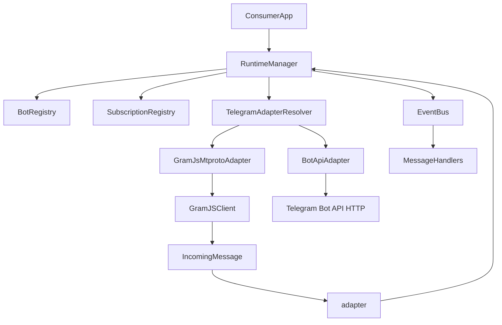

# TRD - Telegram Adapter Kit (TypeScript, Greenfield)

## 1) Objetivo Tecnico

Definir la especificacion tecnica para implementar desde cero un paquete reusable de Telegram que permita:

- registro dinamico de instancias runtime Telegram y suscripciones en runtime,
- lectura de mensajes entrantes,
- escritura a chats/canales y topics,
- API tipada y desacoplada del dominio consumidor.

Este TRD implementa el PRD [`PRD-telegram-runtime-sdk.md`](PRD-telegram-runtime-sdk.md) del proyecto **telegram-adapter-kit**.

## 2) Alcance Tecnico de v1

### Incluido
- Core runtime manager.
- Bot registry y subscription registry en memoria.
- Adapters Telegram internos: GramJS para MTProto y Bot API adapter para bots clasicos.
- Eventos de entrada y hooks de errores/estado.
- Envio de mensajes (chat/topic).
- Build package (ESM + CJS + d.ts).
- Testing unitario + contract tests del adapter.

### Excluido
- Persistencia nativa (DB).
- Multi-provider fuera de Telegram. En v1 si se permiten multiples adapters internos para Telegram: MTProto/GramJS y Bot API.
- Admin UI.
- Declarative config loader como API primaria (queda en v1.1).

## 3) Stack Tecnologico Recomendado

- Lenguaje: TypeScript.
- Runtime: Node.js LTS.
- Telegram providers: GramJS (`telegram` package) para MTProto y `grammY` para Bot API (`botToken`).
- Build: `tsup` (simple para ESM/CJS y tipos) o alternativa `tsc + rollup`.
- Testing: `vitest` (unit/contract rápido) + `@types/node`.
- Lint/format: `eslint` + `prettier`.
- Release: Changesets (opcional pero recomendado).

Decisiones:
- Preferencia v1: `tsup` + `vitest` por simplicidad y velocidad.

## 4) Estructura de Proyecto Propuesta

```text
telegram-adapter-kit/
  src/
    index.ts
    core/
      runtime-manager.ts
      bot-registry.ts
      subscription-registry.ts
      event-bus.ts
    adapters/
      telegram/
        adapter-resolver.ts
        capabilities.ts
        mtproto/
          gramjs-adapter.ts
          gramjs-mappers.ts
          gramjs-errors.ts
          gramjs-handler-registry.ts
        bot-api/
          bot-api-adapter.ts
          bot-api-client.ts
          bot-api-mappers.ts
          bot-api-errors.ts
    contracts/
      sdk.ts
      adapter.ts
      events.ts
      messages.ts
      lifecycle.ts
      operations.ts
      capabilities.ts
    errors/
      base.ts
      validation-error.ts
      bot-not-found-error.ts
      bot-not-started-error.ts
      subscription-not-found-error.ts
      send-message-error.ts
      transient-network-error.ts
      operation-timeout-error.ts
      operation-cancelled-error.ts
      capability-not-supported-error.ts
      lifecycle-conflict-error.ts
    observability/
      logger.ts
      noop-logger.ts
    utils/
      validators.ts
      retry.ts
      timeout.ts
      abort.ts
      ids.ts
  tests/
    unit/
      runtime-manager.test.ts
      bot-registry.test.ts
      subscription-registry.test.ts
      retry.test.ts
    contract/
      telegram-adapter.contract.test.ts
  examples/
    basic-runtime-usage.ts
  package.json
  tsconfig.json
  tsup.config.ts
  vitest.config.ts
  README.md
```

## 5) Contratos Principales

### 5.1 SDK Publico

```ts
export interface TelegramRuntimeSdk {
  registerBot(input: RegisterBotInput, options?: OperationOptions): Promise<void>;
  unregisterBot(botId: string, options?: OperationOptions): Promise<void>;
  startBot(botId: string, options?: OperationOptions): Promise<void>;
  stopBot(botId: string, options?: OperationOptions): Promise<void>;

  registerSubscription(input: RegisterSubscriptionInput, options?: OperationOptions): Promise<void>;
  unregisterSubscription(bindingId: string, options?: OperationOptions): Promise<void>;

  sendMessage(input: SendMessageInput, options?: OperationOptions): Promise<SendMessageResult>;

  onMessage(handler: MessageHandler): UnsubscribeFn;
  onError(handler: ErrorHandler): UnsubscribeFn;
  onBotStateChange(handler: BotStateHandler): UnsubscribeFn;
}
```

### 5.2 Adapter Interno (abstraccion)

```ts
export interface TelegramProviderAdapter {
  readonly kind: TelegramRuntimeKind;
  readonly capabilities: TelegramAdapterCapabilities;

  registerBot(input: RegisterBotInput, options?: OperationOptions): Promise<void>;
  unregisterBot(botId: string, options?: OperationOptions): Promise<void>;
  startBot(botId: string, options?: OperationOptions): Promise<void>;
  stopBot(botId: string, options?: OperationOptions): Promise<void>;

  sendMessage(input: SendMessageInput, options?: OperationOptions): Promise<SendMessageResult>;

  bindIncomingMessages(
    binding: RegisterSubscriptionInput,
    onMessage: (event: IncomingMessageEvent) => void,
    options?: OperationOptions,
  ): Promise<void>;

  unbindIncomingMessages(bindingId: string, options?: OperationOptions): Promise<void>;

  cleanupBot(botId: string, options?: OperationOptions): Promise<void>;
}
```

### 5.3 Modelos Base

```ts
export type TelegramRuntimeKind = "mtproto" | "botApi";

export type MtprotoCredentials = {
  kind: "mtproto";
  apiId: number;
  apiHash: string;
  stringSession: string;
};

export type BotApiCredentials = {
  kind: "botApi";
  botToken: string;
};

export type BotCredentials = MtprotoCredentials | BotApiCredentials;

export type OperationOptions = {
  timeoutMs?: number;
  signal?: AbortSignal;
};

export type RegisterBotInput = {
  botId: string;
  credentials: BotCredentials;
  metadata?: Record<string, unknown>;
};

export type RegisterSubscriptionInput = {
  bindingId: string;
  botId: string;
  chatId: bigint | number | string;
  topicId?: number;
  filters?: {
    textIncludes?: string[];
  };
};

export type SendMessageInput = {
  botId: string;
  chatId: bigint | number | string;
  text: string;
  topicId?: number;
  parseMode?: "markdown" | "html";
  replyToMessageId?: number;
  disableLinkPreview?: boolean;
};

export type SendMessageResult = {
  botId: string;
  chatId: string;
  messageId: number;
  date?: Date;
  raw?: unknown;
};
```

## 6) Flujo de Runtime



Secuencia esperada:
1. App registra bot con `credentials.kind` (`mtproto` o `botApi`).
2. RuntimeManager resuelve el adapter interno correcto.
3. App inicia bot.
4. App registra subscription.
5. Adapter escucha eventos y publica `IncomingMessageEvent`.
6. App envia mensajes usando `sendMessage`.

## 7) Decisiones de Implementacion Clave

### 7.1 Runtime registries en memoria
- `Map<string, BotRuntimeState>` para bots.
- `Map<string, SubscriptionBinding>` para subscriptions.
- Simples, rapidos y suficientes para v1.

### 7.2 Event bus interno
- Implementacion minima sin dependencia externa.
- API `subscribe/publish`.
- Handlers aislados con try/catch para evitar cascadas.

### 7.3 Errores tipados
- Todas las validaciones y fallos operativos deben mapear a clases de error del SDK.
- Nunca propagar errores del provider sin mapear.

### 7.4 Retry policy
- Reintentos configurables para fallos transitorios.
- Estrategia default: exponential backoff corto.
- `maxRetries` y `baseDelayMs` configurables por instancia SDK.

### 7.5 Topics
- `topicId` opcional en modelo de envio.
- Adapter decide mapping exacto al provider.
- Si provider/chat no soporta topics, emitir `SendMessageError` con code especifico.


### 7.6 Lifecycle con estados intermedios

Estados v1:

```ts
export type BotLifecycleStatus =
  | "registered"
  | "starting"
  | "started"
  | "stopping"
  | "stopped"
  | "error";
```

Reglas:

- `registerBot` crea estado `registered`.
- `startBot` transiciona `registered|stopped|error -> starting -> started`.
- `stopBot` transiciona `started|error -> stopping -> stopped`.
- `unregisterBot` requiere cleanup de subscriptions, handlers/listeners y conexion provider.
- Operaciones concurrentes incompatibles deben fallar con `LifecycleConflictError` o serializarse internamente de forma documentada.

### 7.7 Idempotencia por metodo

| Metodo | Politica | Notas de implementacion |
|---|---|---|
| `registerBot` | No idempotente | Duplicado lanza `ValidationError` o `BotAlreadyExistsError` si se agrega. |
| `unregisterBot` | No idempotente | Inexistente lanza `BotNotFoundError`; ejecuta `cleanupBot`. |
| `startBot` | Idempotente si ya esta `started` | `starting` concurrente lanza `LifecycleConflictError` salvo que se implemente lock/queue. |
| `stopBot` | Idempotente si ya esta `stopped` | `stopping` concurrente lanza `LifecycleConflictError` salvo que se implemente lock/queue. |
| `registerSubscription` | No idempotente | Duplicado lanza error tipado; si bind provider falla se revierte registry. |
| `unregisterSubscription` | No idempotente | Inexistente lanza `SubscriptionNotFoundError`; siempre intenta cleanup de binding. |
| `sendMessage` | No idempotente | Retries solo en errores claramente seguros; evitar doble envio en resultados ambiguos. |

### 7.8 Timeout, cancelacion y cleanup

- Toda operacion critica acepta `OperationOptions`.
- `timeoutMs` se implementa con wrapper comun `withTimeout`.
- `signal` se propaga a adapters cuando el provider lo soporte.
- En cancelacion o timeout, el core debe reconciliar estado y emitir evento `runtime_error`.
- `stopBot` y `unregisterBot` deben remover handlers/listeners registrados por el adapter.

### 7.9 Resolucion interna de adapter

La API publica conserva `registerBot/startBot/stopBot/sendMessage`. La decision de adapter queda encapsulada:

```ts
export interface TelegramAdapterResolver {
  resolve(input: RegisterBotInput): TelegramProviderAdapter;
  resolveByBotId(botId: string): TelegramProviderAdapter;
}
```

Reglas:

- `credentials.kind === "mtproto"` usa `GramJsMtprotoAdapter`.
- `credentials.kind === "botApi"` usa `BotApiAdapter`.
- El `BotRegistry` debe persistir `runtimeKind` junto con estado interno.
- Los errores de capability deben ser explicitos (`CapabilityNotSupportedError`).

### 7.10 Resultado del spike tecnico de GramJS (cerrado)

Se considera el spike **resuelto** a nivel de decision de arquitectura para v1.

#### Conclusiones

- **Factibilidad**: GramJS soporta el alcance funcional requerido para v1 del adapter MTProto:
  - `startBot`/`stopBot`,
  - escucha de mensajes entrantes,
  - envio a chat/canal,
  - envio a topic,
  - limpieza de listeners/handlers.
- **Decision**: mantener `GramJsMtprotoAdapter` como implementacion oficial para `credentials.kind === "mtproto"`.
- **Bot API**: para `credentials.kind === "botApi"`, mantener `BotApiAdapter` separado para evitar mezclar semanticas de transporte/capabilities.

#### Aclaracion de riesgo

No existe riesgo de **factibilidad funcional** para GramJS en este alcance.  
Los riesgos que permanecen son operacionales (robustez), no de posibilidad tecnica:

- consistencia de lifecycle en concurrencia (`starting/stopping`),
- estrategia de retry sin duplicar envios en casos ambiguos,
- limpieza garantizada de handlers/listeners por `botId`,
- mapping consistente de errores provider -> errores tipados del SDK.

#### Criterio de cierre del spike

El spike queda cerrado y se reemplaza por validacion obligatoria dentro de implementacion:

- cobertura en `contract tests` del adapter para:
  - lifecycle (`register/start/stop/unregister`),
  - incoming binding (`bind/unbind`),
  - `sendMessage` chat/canal,
  - `sendMessage` con topic,
  - errores: credenciales invalidas, permisos insuficientes, reconexion y cleanup.

Esta validacion no cambia la API publica definida; solo confirma robustez de implementacion.

## 8) Especificacion de Observabilidad

### 8.1 Logger interface

```ts
export interface Logger {
  debug(message: string, meta?: Record<string, unknown>): void;
  info(message: string, meta?: Record<string, unknown>): void;
  warn(message: string, meta?: Record<string, unknown>): void;
  error(message: string, meta?: Record<string, unknown>): void;
}
```

### 8.2 Eventos recomendados
- `bot_registered`
- `bot_starting`
- `bot_started`
- `bot_stopping`
- `bot_stopped`
- `subscription_registered`
- `subscription_removed`
- `message_received`
- `message_sent`
- `runtime_error`

## 9) Build, Packaging y Publicacion

### 9.1 Build targets
- ESM: `dist/index.mjs`
- CJS: `dist/index.cjs`
- Types: `dist/index.d.ts`

### 9.2 package.json (lineamientos)
- `main`, `module`, `types`, `exports` correctamente definidos.
- `sideEffects: false`.
- Scripts:
  - `build`
  - `test`
  - `lint`
  - `typecheck`
  - `prepublishOnly`

### 9.3 Compatibilidad
- Probar import en ESM y require en CJS.

## 10) Estrategia de Testing

### 10.1 Unit tests (core)
- Validaciones de input.
- Registro/deregistro bots y subscriptions.
- Guardrails de lifecycle.
- Event dispatch.
- Retry behavior.

### 10.2 Contract tests (adapter)
- `register/start/stop bot`.
- `bind/unbind incoming messages`.
- `send message normal`.
- `send message con topic`.
- Mapping de errores provider -> SDK errors.

### 10.3 Criterios minimos de calidad
- Cobertura minima sugerida: 80% lineas en core.
- 100% de casos criticos del lifecycle.

## 11) Seguridad y Manejo de Secretos

- Nunca exponer `apiHash`, `stringSession` completa o `botToken` en logs.
- En logs, enmascarar secretos (`****`).
- SDK no almacena secretos en disco por defecto.
- Consumidor es responsable de secret manager/env injection.

## 12) Plan de Ejecucion Tecnica (Sprints)

### Sprint 1 - Foundation
- Scaffold package.
- Contratos base y error model.
- Logger + validadores.

### Sprint 2 - Runtime Core
- RuntimeManager.
- Registries.
- Event bus.
- Unit tests core.

### Sprint 3 - Telegram Adapter
- Validacion contractual del adapter (spike absorbido en contract tests y criterios TRD 7.10).
- Integracion GramJS MTProto.
- Integracion Bot API adapter con `grammY`.
- Incoming events.
- Outgoing send (chat/topic).
- Contract tests iniciales.

### Sprint 4 - Hardening y Release
- Retry/backoff configurable.
- Documentacion completa.
- Ejemplo runnable.
- Build/release checklist.

## 13) Checklist de Definition of Done (DoD)

- [ ] API publica estable definida.
- [ ] Tipos exportados sin `any` en superficie publica.
- [ ] Unit tests y contract tests verdes.
- [ ] README con quickstart y ejemplos.
- [ ] Build ESM/CJS/d.ts validado.
- [ ] Manejo de errores tipados y documentados.
- [ ] Estados intermedios de lifecycle cubiertos por tests.
- [ ] Timeout/cancelacion cubiertos por tests.
- [ ] Cierre de spike GramJS aplicado (TRD 7.10) y validado via contract tests.
- [ ] Publicacion RC lista.

## 14) Riesgos Tecnicos y Mitigaciones

- Riesgo: comportamiento heterogeneo de Telegram para topics.
  - Mitigacion: pruebas contractuales y validacion previa de capability.

- Riesgo: dependencia fuerte de un solo provider lib.
  - Mitigacion: mantener contrato `TelegramProviderAdapter` estable y desacoplado.

- Riesgo: API growth descontrolado.
  - Mitigacion: policy de semver + RFC interna para cambios mayores.

## 15) Entregables Finales de v1

- Paquete `telegram-adapter-kit` publicable (npm: `@scope/telegram-adapter-kit` segun organizacion).
- API runtime estable.
- Soporte lectura y escritura chat/topic.
- Tipos y errores documentados.
- Suite de pruebas y ejemplo de uso.
- Guia de integracion para equipos consumidores.
